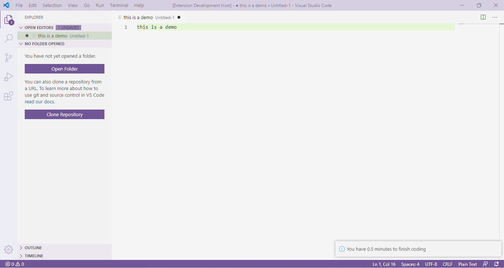
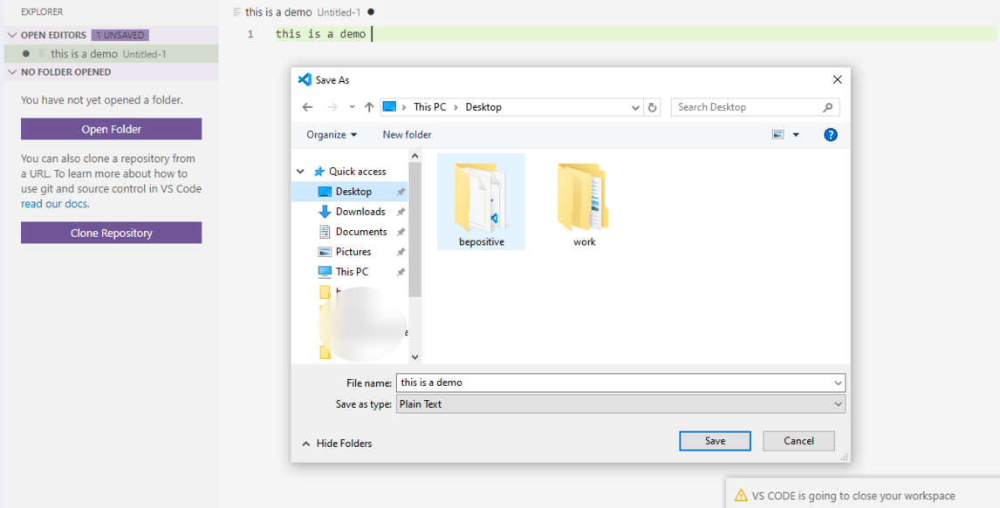

# enough-coding README

Enough coding, now its time to stop!

## Description

Use this extension if you want to set a time imit to your coding sessions. If you lose track of time while coding, this extension is for you. It will remind you the time limit you have set for a session, and when the limit is reached it will automatically save all files and close the window.

## Features

* Activate/ Deactivate when required
* Change timeout duration 
* Saves all files 

Timeout Warning 

 

Prompt to save file for files created using File-->New File

 

> For other kinds of open files, it will save them automatically.

## Extension Settings

This extension contributes the following settings:

* `enough-coding.active`: enable/disable this extension
* `enough-coding.duration`: set timeout duration in minutes (defaults to 10)

## LICENSE
This extension is licensed under the [MIT License](LICENSE)

